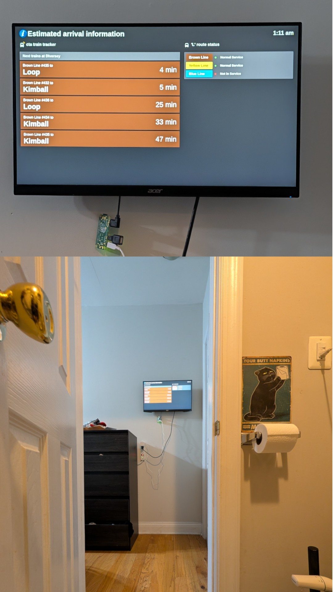
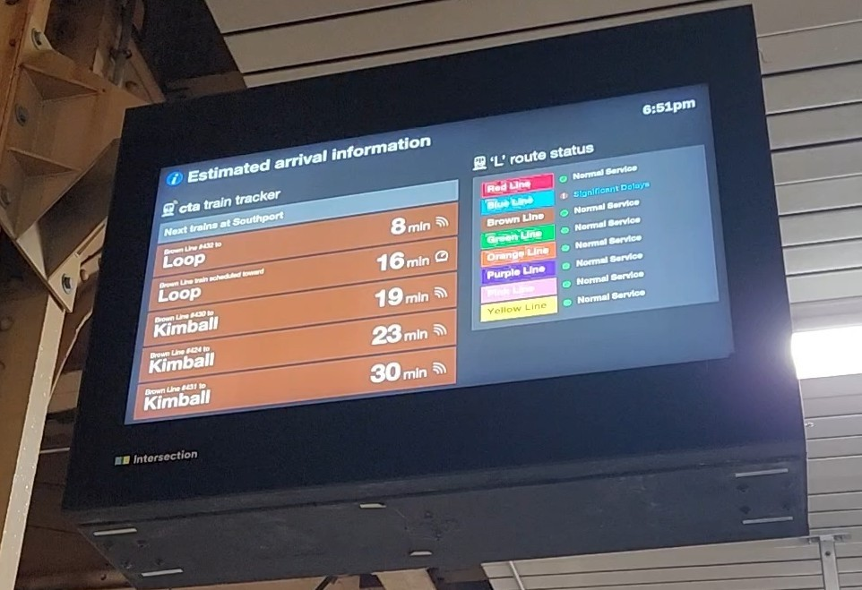

# CTA Transit Info Display

A real-time CTA train arrival display built with a Raspberry Pi and a used monitor.

## How It Works

A Raspberry Pi Zero W 2 runs a Python app (PySide6) that pulls live train arrivals from the [CTA Train Tracker API](https://www.transitchicago.com/developers/traintracker/). The app launches automatically on boot via labwc autostart.

A replica of the real CTA arrival boards at L stations:

## Cost Breakdown

| Part | Price | Required |
|------|-------|----------|
| Raspberry Pi Zero W 2 (with headers) | $17.99 | Yes |
| ACER monitor (used) | $10.00 | Yes |
| Inland flat plug extension (4 outlets, 6ft) | $9.99 | Optional |
| SanDisk 64GB Ultra MicroSDXC | $8.99 | Yes |
| Raspberry Pi 12.5W power supply | $7.99 | Yes |
| TETVIK monitor wall mount (14-24", VESA 100x100) | $5.52 | Optional |
| **Total** | **$60.48** | |

Around $45 for the essentials, or ~$60 with wall mount and extension cord.

## Getting Started

See [docs/setup.md](docs/setup.md) for installation, deployment, and kiosk mode.

## FAQ

**Q: Why did you build this?**\
A: I wanted to know when the next Brown Line is coming while doing my business. Also, it's a love letter to Chicago.

**Q: Is this actually live CTA data?**\
A: Yes. It updates with real arrival info.

**Q: What station is it tracking?**\
A: Diversey — it's my station.

**Q: What did you use to make it?**\
A: Raspberry Pi + monitor + CTA data + great taste.

**Q: Why the Brown Line in a bathroom?**\
A: If you have to ask, I can't help you.

**Q: Why is it in the hallway?**\
A: I put it right outside the bathroom door so the monitor and Raspberry Pi don't get destroyed by shower humidity, but it's perfectly visible from the throne.

**Q: What monitor do I need?**\
A: Any small monitor (14-24") with HDMI input. A used one works great. If wall-mounting, look for VESA 100x100mm mounting holes.

**Q: Can I use a different Raspberry Pi?**\
A: Yes. The Pi Zero W 2 is the cheapest option with Wi-Fi, but any Pi with HDMI and Wi-Fi will work.

**Q: Could this be used somewhere normal?**\
A: Technically yes.

**Q: Are you proud of this?**\
A: Yes; very.
